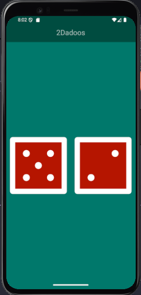

# 👩🏽‍💻 Projetos Desenvolvidos em Flutter

## 📇 Cartão de Visita Digital - Patrícia Silva

Este aplicativo foi desenvolvido em **Flutter** como parte dos meus estudos em desenvolvimento mobile. Ele funciona como um cartão de visitas.

### 📱 Visual do Aplicativo
Abaixo, a interface principal rodando em modo estável:

  

### 📥 Download do App
Como o arquivo é uma versão de demonstração, você pode baixá-lo diretamente pelo link abaixo:

> **[👉 Clique aqui para baixar o APK (Cartão de Visita.apk)](https://github.com/Silv-Patricia/Flutter-Projects/raw/refs/heads/main/Cart%C3%A3o%20de%20Visita/Cart%C3%A3o%20de%20Visita.apk)**

---

### 🛠️ Tecnologias e Informações
* **Linguagem:** Dart
* **Framework:** Flutter

---

## 🎲 2Dados - Sorteio Aleatório
Este aplicativo simula o lançamento de dois dados simultaneamente. Foi um projeto focado no aprendizado de **Gerenciamento de Estado (StatefulWidgets)** e lógica de interação com o usuário.

### 📱 Visual do Aplicativo
O app conta com uma interface limpa onde ambos os dados reagem a cada toque na tela:

  
  

### 📥 Download do App
Você pode testar a lógica de sorteio baixando o APK abaixo:

> **[👉 Clique aqui para baixar o APK (2Dadoos.apk)](https://raw.githubusercontent.com/Silv-Patricia/Flutter-Projects/refs/heads/main/2Dadoos/2Dadoos.apk)**

--- 

### 🛠️ Tecnologias e Informações
* **Linguagem:** Dart
* **Framework:** Flutter

---
## 🧮 Calculadora Simples
Uma claculadora que efetua contas simples, e que mostra o resultado ao mesmo tempo qem que se digita.

### 📱 Visual do Aplicativo
O app conta com uma interface limpa onde ambos os dados reagem a cada toque na tela:

  
  

### 📥 Download do App

> **[👉 Clique aqui para baixar o APK (Calculadora Simples.apk)](https://raw.githubusercontent.com/Silv-Patricia/Flutter-Projects/refs/heads/main/Calculadora%20Simples/Calculadora%20Simples.apk))**

---

>*Projetos em constante evolução para fins de aprendizado.*
